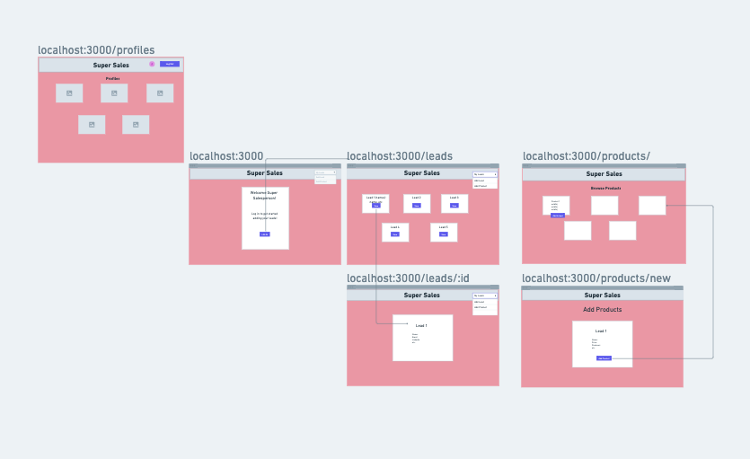

# Sales CRM CRUD App
## 💥  Getting Started

🗣️ This application is a simple CRUD app that allows a user to sign in using Google OAuth and create, update, and delete leads like a salesperson would. 

☝️ After signing in, the user is routed to the leads page to start adding leads and has the option to add products to a lead.

## 🏠  HomePage

## Trello Board and WireFrame
[Trello](https://trello.com/b/7obYol9d/unit-2-sales-crm-crud)

[Wireframe](https://whimsical.com/sales-crud-app-VxZUN3QSwTcPg4ddyU29q2)

## 🖥️  Technologies

 
 

## 💪 Next Steps